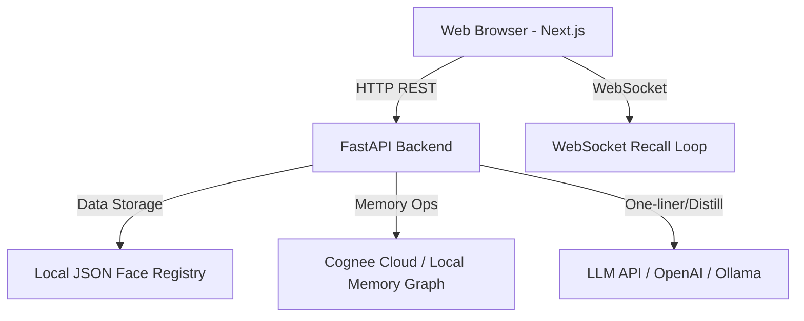

# System Architecture

The ForgetMeNot application consists of a FastAPI backend and a Next.js (shadcn/ui + Tailwind CSS) frontend.

## Frontend Components
* **Landing Page (`/`)**: A modern marketing interface highlighting features, how-it-works steps, and metrics.
* **Camera Dashboard (`/camera`)**: The interactive dementia care assistant that reads local video frames, executes client-side face recognition using `face-api.js`, and displays Cognee memory cards anchored to recognised faces.

## Backend Components
* **REST API (`backend/main.py`)**: Handles person enrollment, adding observations to session memory, audio transcription (via Whisper), distillation to permanent memory, and profile deletion.
* **WebSocket Server (`backend/main.py`)**: Connects to the browser's live face descriptor stream (128 floats) at 2 FPS, matches against the local face registry, recalls facts from Cognee, and sends back summaries.
* **Memory Adapter (`backend/memory.py`)**: Interfaces with Cognee Cloud/Local using standard lifecycle methods (`remember`, `recall`, `improve`, `forget`).
* **Face Matching Registry (`backend/registry.py`)**: Stores 128-float descriptors and metadata in `people.json`, performing local Euclidean distance matching.
* **LLM Prompt Manager (`backend/llm.py`)**: Formulates the prompt instructions for distilling raw session notes into permanent memory and generating short one-liner reminders.

## CORS & Static File Serving
* During development, the frontend runs on port 3000 and FastAPI runs on port 8000. CORS middleware is enabled to allow cross-origin requests.
* For production/headless environments, Next.js compiles to static HTML/CSS/JS (`frontend/out`). FastAPI's catch-all route serves these static files directly on port 8000, avoiding CORS completely.
